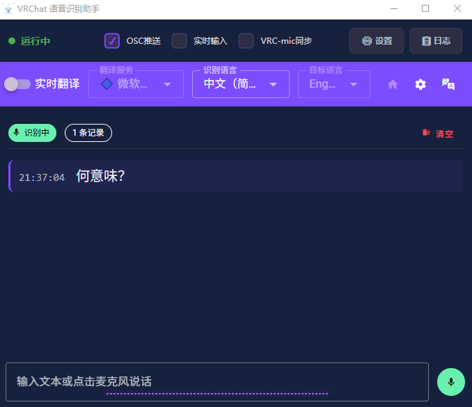

# VRChat 语音识别助手

<div align="center">



**实时语音识别 + 翻译 + OSC 推送 **

[](https://dotnet.microsoft.com/)
[](https://vuejs.org/)
[](LICENSE)
[](https://www.microsoft.com/windows)

</div>

---

## ✨ 功能特点

### 🎤 语音识别

- **实时连续识别** - 基于 Web Speech API 的语音识别

### 🌐 翻译服务

**免费服务**

- Google 翻译、微软翻译、MyMemory

**AI 翻译（统一配置）**

- OpenAI (GPT-4o-mini, GPT-3.5-turbo)
- Google Gemini (Gemini 2.0 Flash, 1.5 Pro)
- Anthropic Claude (Claude Sonnet 4.0, 3.5)
- Ollama（本地运行，完全免费）
- LM Studio（本地运行）
- 自定义 API（兼容 OpenAI 格式）

**AI 特性**

- ✅ 自动获取模型列表
- ✅ 一键连接测试

### 🎮 VRChat 集成

- **OSC 推送** - 实时发送识别结果到 VRChat
- **麦克风同步** - 跟随 VRChat 麦克风状态
- **实时更新** - 支持临时文本实时推送
- **消息队列** - 智能管理，避免频繁更新

### 🎨 用户界面

- **现代化设计** - Vue 3 + Vuetify 3
- **6 种主题** - 深色/浅色主题切换
- **响应式布局** - 适配不同屏幕
- **实时反馈** - 状态、进度、连接指示

---

## 🚀 快速开始

### 系统要求

- Windows 10/11
- .NET 8.0 Runtime
- Chrome/Edge 浏览器（支持 Web Speech API）

### 安装步骤

1. **下载并解压**
   
   ```
   下载最新版本并解压到任意目录
   ```

2. **启动程序**
   
   ```
   双击 VRChatSpeechAssistant.exe
   或运行 一键构建.bat 进行编译
   ```

3. **开始使用**
   
   - 程序会自动加载网页应用
   - 点击底部麦克风按钮开始识别
   - 识别结果自动发送到 VRChat

---

## 📖 使用说明

### 基础使用

1. **语音识别**
   
   - 点击麦克风按钮开始/停止识别
   - 对着麦克风说话
   - 识别结果实时显示并发送

2. **手动输入**
   
   - 在底部输入框输入文本
   - 按 Enter 或点击发送
   - 支持翻译和 OSC 推送

3. **翻译配置**
   
   - 点击顶部翻译开关启用
   - 选择翻译服务和目标语言
   - 点击设置图标配置 API

### AI 翻译配置

**推荐：使用 Ollama（完全免费）**

1. 安装 Ollama
   
   ```bash
   # 从 https://ollama.ai 下载安装
   ```

2. 拉取模型
   
   ```bash
   ollama pull qwen2.5:latest
   ```

3. 在应用中配置
   
   - 选择 "Ollama" 提供商
   - 点击 "测试连接"
   - 点击 "获取模型" 选择模型
   - 测试翻译并保存

**使用 OpenAI/Gemini/Claude**

- 获取对应服务的 API Key
- 在翻译配置页面输入
- 测试连接和翻译
- 保存配置

### 高级功能

**VRChat 麦克风同步**

- 在设置中启用 "VRC 麦克风同步"
- VRChat 麦克风静音时不发送消息

**OSC 实时更新**

- 启用后临时识别文本实时推送
- 使用节流策略避免频繁更新

**灵敏度调节**

- 调整滑块过滤噪音
- 推荐值：10-20

---

## ⚙️ 配置说明

### 桌面程序设置

| 设置项       | 默认值       | 说明              |
| --------- | --------- | --------------- |
| OSC 目标 IP | 127.0.0.1 | VRChat IP 地址    |
| OSC 目标端口  | 9000      | VRChat OSC 接收端口 |
| OSC 监听端口  | 9001      | 接收 VRChat 状态端口  |
| HTTP 端口   | 3230      | 网页服务器端口         |

### 网页应用设置

| 设置项   | 默认值       | 说明          |
| ----- | --------- | ----------- |
| 识别语言  | zh-CN     | 语音识别源语言     |
| 目标语言  | -         | 翻译目标语言      |
| 翻译服务  | microsoft | 翻译服务提供商     |
| 灵敏度阈值 | 0         | 音量门限（0-100） |

---

## 🔧 故障排除

### VRChat 收不到消息

- [ ] VRChat 是否启用 OSC
- [ ] OSC 端口是否正确（127.0.0.1:9000）
- [ ] 桌面程序中 "启用 OSC 发送" 是否勾选
- [ ] 查看 OSC 历史记录确认消息发送

### AI 翻译不工作

1. 点击 "测试连接" 验证配置
2. 检查 API Key 是否正确
3. 检查网络连接
4. 使用 "测试翻译" 功能排查

### 获取模型列表失败

- 确认 Ollama/LM Studio 已启动
- 验证 API Key 有效性
- 检查 Base URL 配置
- 查看详细错误信息

---

## 🏗️ 技术架构

```
┌─────────────────────────────────────────┐
│         桌面应用 (WPF + WebView2)        │
│  ┌───────────────────────────────────┐  │
│  │   Vue 3 + Vuetify 3 网页应用      │  │
│  │  - 语音识别 (Web Speech API)     │  │
│  │  - 翻译服务 (10+ 种)             │  │
│  │  - AI 翻译 (6 种提供商)          │  │
│  │  - 音频可视化                    │  │
│  └───────────────────────────────────┘  │
│              ↕ JavaScript ↔ C#          │
│  ┌───────────────────────────────────┐  │
│  │         OSC 服务                  │  │
│  │  - 消息队列管理                  │  │
│  │  - VRC 状态监听                  │  │
│  └───────────────────────────────────┘  │
└─────────────────────────────────────────┘
                ↕ OSC (UDP)
┌─────────────────────────────────────────┐
│              VRChat                     │
│  - 接收聊天消息 (端口 9000)            │
│  - 发送麦克风状态 (端口 9001)          │
└─────────────────────────────────────────┘
```

---

## 📦 技术栈

**桌面应用**

- .NET 8.0 + WPF
- WebView2（Microsoft Edge）
- System.Net.Sockets（OSC）

**网页应用**

- Vue 3.5 + Vuetify 3.7
- Vite 5.4 + TypeScript
- Web Speech API

**翻译服务**

- Google/Microsoft Translator
- OpenAI/Gemini/Claude API
- Ollama/LM Studio（本地）

---

## 🛠️ 开发指南

### 环境准备

```bash
# 安装 .NET 8.0 SDK
# 从 https://dotnet.microsoft.com/download 下载

# 安装 Node.js 18+
# 从 https://nodejs.org 下载
```

### 开发桌面应用

```bash
dotnet restore
dotnet build
dotnet run
```

### 开发网页应用

```bash
cd vue-app
npm install
npm run dev
```

### 构建发布版本

```bash
# 方式 1: 使用一键构建脚本
一键构建.bat          # 发布版本
一键构建-开发版.bat    # 开发版本

# 方式 2: 手动构建
# 构建网页应用
cd vue-app
npm run build

# 发布桌面应用
cd ..
dotnet publish -c Release -r win-x64 --self-contained
```

### 项目结构

```
web/
├── MainWindow.xaml              # 主窗口 UI
├── MainWindow.xaml.cs           # 主窗口逻辑
├── SettingsWindow.xaml          # 设置窗口
├── LogWindow.xaml               # 日志窗口
├── DesktopBridge.csproj         # 项目配置
├── 一键构建.bat                 # 构建脚本
├── 一键构建-开发版.bat          # 开发构建脚本
├── img/                         # 图片资源
│   └── 1.png                    # 主界面截图
├── dist/                        # Vue 构建输出
└── vue-app/                     # Vue 源代码
    ├── src/
    │   ├── App.vue              # 主应用
    │   ├── main.js              # 入口文件
    │   ├── components/          # UI 组件
    │   │   ├── AppToolbar.vue
    │   │   ├── LogDisplay.vue
    │   │   ├── AudioFooter.vue
    │   │   └── TranslationSettings.vue
    │   ├── composables/         # 组合式函数
    │   │   ├── useSpeechRecognition.js
    │   │   ├── useTranslation.js
    │   │   ├── useAudioVisualizer.js
    │   │   └── translation/     # 翻译服务
    │   │       ├── types.ts
    │   │       ├── constants.ts
    │   │       └── services/
    │   │           ├── ai.ts    # AI 翻译
    │   │           └── index.ts
    │   └── assets/              # 静态资源
    ├── package.json
    └── vite.config.js
```

---

## 📄 许可证

本项目采用 MIT 许可证

---

## 🙏 致谢

- [Vue.js](https://vuejs.org/) - JavaScript 框架
- [Vuetify](https://vuetifyjs.com/) - Material Design 组件库
- [Web Speech API](https://developer.mozilla.org/en-US/docs/Web/API/Web_Speech_API) - 浏览器语音识别
- [Ollama](https://ollama.ai/) - 本地 LLM 工具

---

<div align="center">

**如果这个项目对你有帮助，请给个 ⭐️ Star 支持一下！**

Made with ❤️ for VRChat Community

</div>
